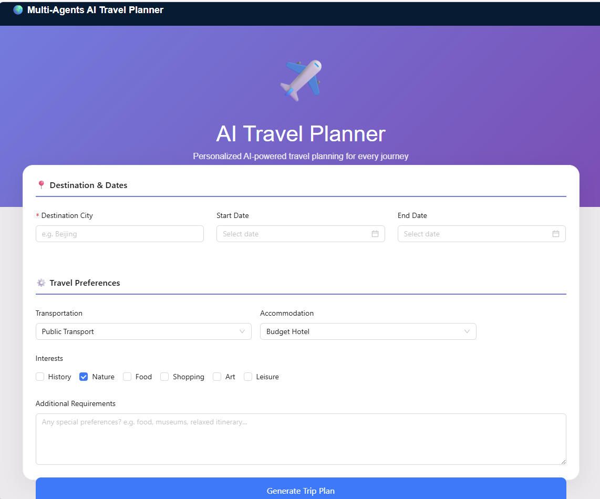

\section*{AI Travel Planner}

An AI-powered travel planning system that generates personalized multi-day travel itineraries based on user preferences.

Users can enter a destination, travel dates, and preferences, and the system automatically generates a structured travel plan including attractions, meals, hotels, and daily schedules.

\subsection*{Demo}

Example flow:

Enter destination city

Select travel dates

Choose travel preferences

Generate a personalized trip itinerary

Features

AI-generated travel itineraries

Multi-day trip planning

Attraction, restaurant, and hotel recommendations

Interactive frontend interface

Export travel plans as image or PDF

Tech Stack

Frontend

React

TypeScript

Vite

Ant Design

Backend

FastAPI

Python

LLM APIs